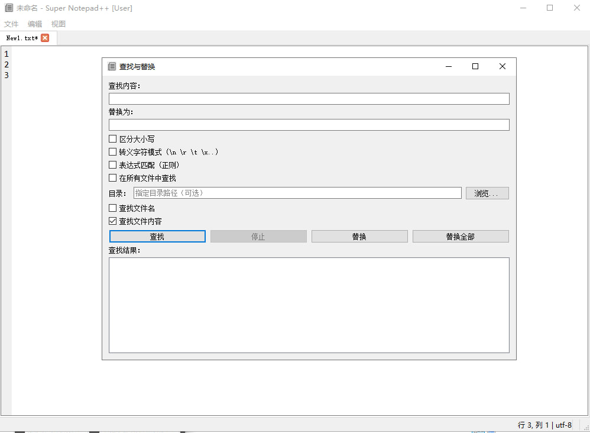
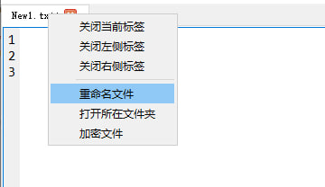

# 📝 Super Notepad GUI（高级文本编辑器）

一个基于 **Python ** 开发的轻量级但功能强大的桌面文本编辑器，定位为 **程序员 / 运维 / 安全研究人员** 使用的多用途编辑工具，兼顾性能、可扩展性与安全性。

---

## ✨ 核心特性

### 📂 多标签编辑
- 支持同时打开多个文件
- 标签页显示文件名，未保存状态自动标记
- 支持新建 / 保存 / 另存为
- 支持快捷键 `Ctrl+S`

---

### 📑 多格式文件查看（只读预览）
支持在同一程序内**直接查看常见办公与文档格式**，无需额外打开外部软件。

#### ✔ 支持的文件类型
- **Word**：`.doc` / `.docx`
- **Excel**：`.xls` / `.xlsx`
- **PDF**：`.pdf`
- **图片**：`.png` `.jpg` `.jpeg` `.bmp` `.gif`

#### ✔ 行为说明
- 文档 / 表格 / PDF / 图片以 **只读模式** 打开
- 不影响当前正在编辑的文本文件
- 支持多标签并行查看
- 关闭即释放内存资源

> 适用于快速查看日志附件、报告、表格、截图等文件

---

### 🔍 查找与替换（高级）
支持 **当前文件 / 所有已打开文件 / 指定目录** 的查找与替换。

#### ✔ 普通查找
- 支持大小写敏感 / 不敏感
- 支持文件名匹配 / 内容匹配

#### ✔ 转义字符匹配模式
启用后，查找与替换支持以下转义序列：

| 转义 | 含义 |
|----|----|
| `\n` | 换行 |
| `\r` | 回车 |
| `\t` | 制表符（等价于 4 个空格） |
| `\0` | NULL |
| `\xNN` | 十六进制字符 |

> 适用于日志、协议、二进制文本等场景

#### ✔ 表达式匹配（正则）
- 支持 Python 正则表达式
- 支持分组与反向引用（`\1 \2`）
- 支持多行、忽略大小写

---

### 🔁 替换模式
- **替换全部**：一次性替换所有匹配
- **逐个替换（Replace Next）**：
  - 从当前光标位置开始向后查找
  - 每点击一次只替换一个
  - 自动跳转到下一处

---

### 🟡 实时高亮
- 选中文本后：
  - 当前页面内所有相同字符串自动高亮
  - 取消选中自动清除
- 不影响原文本内容
- 不影响撤销 / 重做

---

### 🔐 `.sup` 加密文件支持
专为安全场景设计的加密文本格式：

- `.sup` 文件使用 **AES-256** 加密

- 打开 `.sup` 文件时弹出密码输入框

- 加密内容仅在内存中明文存在

- 保存时自动加密写入磁盘

- 支持：
  - 手动加密当前标签页
  
  - 自定义密码
  
  - 安全编辑（内存态明文）
  
    

---

### 🧠 编码与状态栏
- 状态栏实时显示：
  - 当前行号 / 列号
  - 文件编码
- 保存时自动处理编码：
  - 优先原编码
  - 失败时自动回退 UTF-8

---

### 🧵 高性能目录搜索
- 目录搜索使用后台线程
- 不阻塞 UI
- 实时显示结果
- 可随时中断搜索

---

### 🖱️ 右键增强功能
- 标签页右键：
  - 加密文件
  - 关闭标签
- 编辑区右键：
  - 常规编辑操作
  - 可扩展菜单结构

---

## ⌨️ 快捷键（部分）

| 快捷键 | 功能 |
|-----|-----|
| `Ctrl + S` | 保存 |
| `Ctrl + F` | 查找 |
| `Ctrl + H` | 查找与替换 |
| `Ctrl + Tab` | 切换标签 |

---

## 🎯 适用场景

- 程序代码编辑
- 日志分析
- 配置文件维护
- 安全文本（密钥 / token）编辑
- 运维 / 安全研究辅助工具
- 文档 / 报告 / 表格快速查看

---

## 📌 项目定位说明

> 本项目不是简单的记事本克隆，而是一个 **可持续扩展的桌面编辑器 / 查看器混合工具**。  
> 重点放在：
>
> - 编辑效率  
> - 文件查看一体化  
> - 安全性  
> - 高级查找替换能力  
> - 清晰、可维护的代码结构  

---

## 📜 License

MIT License

---

## 🤝 贡献

欢迎提交 Issue / PR  
如果你有以下需求，也非常欢迎讨论：

- 多光标
- 语法高亮
- 插件系统
- LSP 支持
- 文件对比
- 更多文档格式支持

---

> 如果你喜欢这个项目，欢迎 ⭐ Star！
